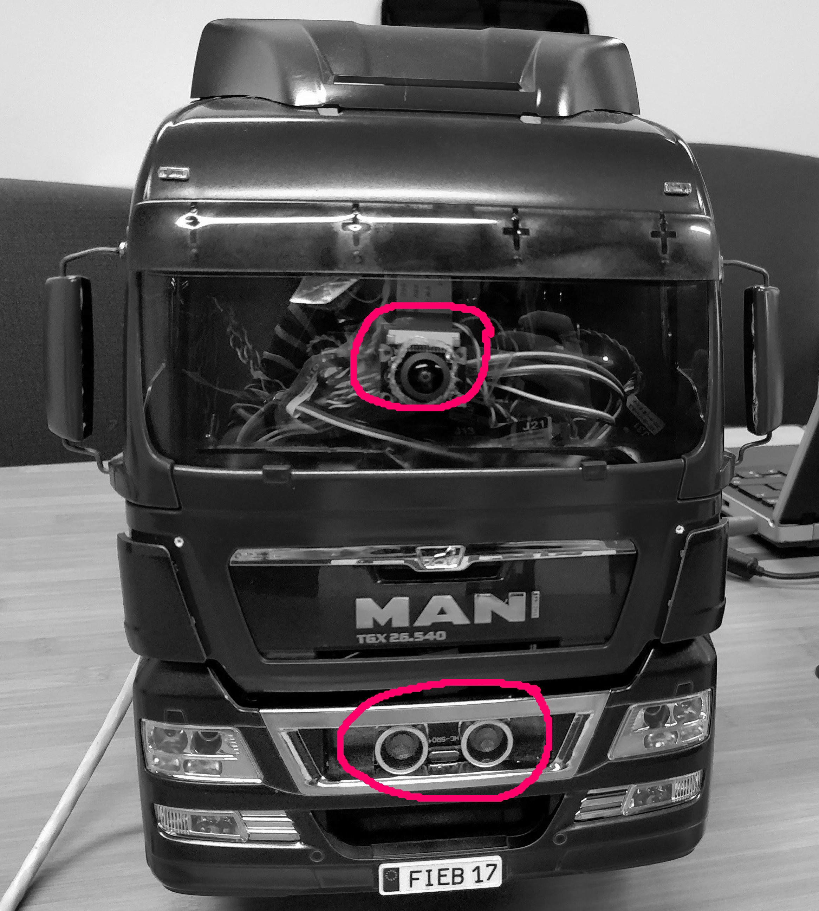

```{r setup, include=FALSE}
options(htmltools.dir.version = FALSE)
```
class: inverse, center, middle

# The FIEB Truck

---
background-image: url("truck_bw.jpg")
background-size: cover
class: center, bottom, inverse

# MAN TGX 26.540 Cyclops Edition

## Fully Electric, Self-Driving (at least sort of)

---

# Modifications

.pull-left[

### Adding computer and sensors

- Replaced remote control unit with [Raspberry Pi 3 Model B](https://www.google.com)

- Added [two ultrasonic distance sensors](https://www.google.com) (front highlighted)

- Added [accelerometer](https://www.google.com)

- Added [wide angle camera](https://www.google.com) (highlighted)

- Added [10k mAh powerbank](https://www.google.com) to power the Raspberry

- Fancy blue and black metallic paint job (done by ourselves)
]

.pull-right[

]

---
class: center, middle, inverse

# Hardware and Software Implementation

---
background-image: url("truck_work_bw.png")
background-size: cover
class: center, bottom, inverse

# The Foundation

## Hardware wiring, RobotOS

---
# Implementation: The Foundation

### Wiring the hardware

- Raspberry as drop-in replacement for the remote control receiver
- Reverse engineering signals to be sent by Raspberry to the truck's main control unit
- Sensors directly connected to the Raspberry

### Using Robot Operating System (ROS) as main software

- [ROS](http://www.ros.org/) as foundation on Raspberry and remote laptop
- Separate subscribable topics per sensor (ultrasonic, camera, accelerometer)

### Architecture and Control

- Streaming of sensor data via wifi from Raspberry to remote laptop (real-time)
- Control logic implemented on remote laptop
- Sending controls from remote laptop to Raspberry (real-time)

---
background-image: url("truck_work_bw.png")
background-size: cover
class: center, bottom, inverse

# The Self-Driving Logic

## Python, OpenCV, ArUco markers

---
# Implementation: The Self-Driving Logic

### Platooning Logic

.pull-left[
- Follow [ArUco](https://www.google.de) marker (simple 2D barcode, similar to QR-Code) detected via camera

- Maintain distance to truck in front as measured by ultrasonic sensor

- Features: Adaptive steering and distance, real-time [ArUco](https://www.google.de) detection
]

.pull-right[

]
---
background-image: url("demo_bw.jpg")
background-size: cover
class: center, bottom, inverse

# Live Demo Time

## Wohooo!

---
# Sidenotes

### Notes

- Code and slides can be found on [**github**](https://github.com/rseed42/MAN_RC_Truck)

